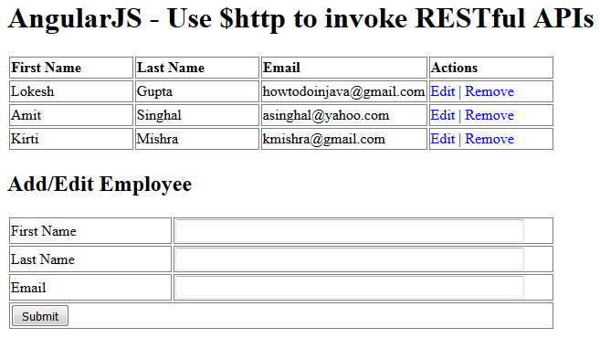

= AngularJS $http – RESTful API Example
Doc Writer <pavel.kiselev@gmail.com>
v1.0
:toc:

http://howtodoinjava.com/angularjs/angularjs-http-restful-api-example/[original]

****
In this tutorial, we will learn to use Angular `$http` service to invoke RESTful APIs (HTTP GET, PUT, POST, DELETE) operations. Additionally, we will use the responses from RESTFul APIs to refresh the screen data used in this example.
****

== Overview of example

We will build a screen for employee management. You will be able to get/add/edit/delete employees from this screen using various links and buttons. The screen looks like this:

//image::angular-http-service-example.png[angular http service example]

The screen options are quite simple. You can add an employee using the form below. All employees get listed in upper table. You can remove an employee by clicking on “Remove” link in that row. Similarily, clicking on edit link will populate employee details in form below and you can save the changes by pressing submit button.

== $http usage – for impatient

Though I will be going into detail later in this tutorial, if you are in hurry the read this section to understand the `$http` calls to RESTful APIs.

=== RESTful GET operation

Angular $http can be used to invoke HTTP GET api in below manner. In this example, this code is used to *get all employees* from server.

[source,java]
----
$http({
    method : 'GET',
    url : 'employees'
}).then(function successCallback(response) {
    $scope.employees = response.data.employees;
}, function errorCallback(response) {
    console.log(response.statusText);
});
----

Above GET call is using relative URL `/employees`. This will invoke `HTTP GET http://localhost:8080/myapplication/employees` URL if current location is `HTTP GET http://localhost:8080/myapplication`. You can use the full application URL as well e.g. “http://localhost:8080/myapplication/employees”. Both URL patterns will work.

By default, angular uses *asynchronous HTTP calls*. SO I have used two functions `successCallback()` and `errorCallback()`, which will be invoked by angular after a response is returned from server.

=== RESTful POST operation

Angular `$http` can be used to invoke HTTP POST api in below manner. In this example, this code is used to *add an employee* into the system.

[source,java]
----
$http({
    method : "POST",
    url : "employees",
    data : angular.toJson($scope.form),
    headers : {
        'Content-Type' : 'application/json'
    }
}).then( _success, _error );
----

In above method call, I have passed the request payload in JSON format using `angular.toJson()` method, and then I have set up the `content-type` header parameter to `application/json`.

=== RESTful PUT operation

Angular `$http` can be used to invoke HTTP PUT api in below manner. In this example, this code is used to *update an employee* into the system.

[source,java]
----
$http({
    method : "PUT",
    url : "employees/" + $scope.form.id,
    data : angular.toJson($scope.form),
    headers : {
        'Content-Type' : 'application/json'
    }
}).then( _success, _error );
----

=== RESTful DELETE operation

Angular `$http` can be used to invoke HTTP DETELE api in below manner. In this example, this code is used to *delete an employee* into the system.

[source,java]
----
$http({
    method : "DELETE",
    url : "employees/" + employee.id
}).then( _success, _error );
----

== RESTFul APIs used in example

Now let’s go through RESTful APIs used in this example. These have been created using the sourcecode from http://howtodoinjava.com/spring/spring-restful/spring-rest-hello-world-json-example/[Spring REST JSON Example].

[source,java]
----
package com.howtodoinjava.demo.controller;

import org.springframework.http.HttpStatus;
import org.springframework.http.MediaType;
import org.springframework.http.ResponseEntity;
import org.springframework.stereotype.Controller;
import org.springframework.web.bind.annotation.PathVariable;
import org.springframework.web.bind.annotation.RequestBody;
import org.springframework.web.bind.annotation.RequestMapping;
import org.springframework.web.bind.annotation.RequestMethod;

import com.howtodoinjava.demo.model.EmployeeListVO;
import com.howtodoinjava.demo.model.EmployeeVO;

@Controller
public class EmployeeRESTController
{
    //Local storage of employees for demo; You will use database here
    private static EmployeeListVO employees = new EmployeeListVO();

    //add some employees here
    public EmployeeRESTController()
    {
        EmployeeVO empOne = new EmployeeVO(1,"Lokesh","Gupta","howtodoinjava@gmail.com");
        EmployeeVO empTwo = new EmployeeVO(2,"Amit","Singhal","asinghal@yahoo.com");
        EmployeeVO empThree = new EmployeeVO(3,"Kirti","Mishra","kmishra@gmail.com");

        employees.getEmployees().add(empOne);
        employees.getEmployees().add(empTwo);
        employees.getEmployees().add(empThree);
    }

    //Utility methods for getting employee by id
    private EmployeeVO _getEmployeeById(int id){
        for(EmployeeVO e : employees.getEmployees()){
            if(e.getId() == id){
                return e;
            }
        }
        return null;
    }

    /**
     * HTTP GET - Get all employees
     * */
    @RequestMapping(value = "/employees", produces = MediaType.APPLICATION_JSON_VALUE,  method = RequestMethod.GET)
    public ResponseEntity<EmployeeListVO> getAllEmployeesJSON()
    {
        return new ResponseEntity<EmployeeListVO>(employees, HttpStatus.OK);
    }

    /**
     * HTTP POST - Create new Employee
     * */
    @RequestMapping(value = "/employees", consumes = MediaType.APPLICATION_JSON_VALUE, method = RequestMethod.POST)
    public ResponseEntity<String> createEmployee(@RequestBody EmployeeVO employee)
    {
        employee.setId(employees.getEmployees().size() + 1);
        employees.getEmployees().add(employee);
        return new ResponseEntity<String>(HttpStatus.CREATED);
    }

    /**
     * HTTP PUT - Update employee
     * */
    @RequestMapping(value = "/employees/{id}", consumes = MediaType.APPLICATION_JSON_VALUE, method = RequestMethod.PUT)
    public ResponseEntity<EmployeeVO> updateEmployee(@PathVariable("id") int id, @RequestBody EmployeeVO employee)
    {
        EmployeeVO emp = _getEmployeeById(id);
        if(emp != null){
            emp.setFirstName(employee.getFirstName());
            emp.setLastName(employee.getLastName());
            emp.setEmail(employee.getEmail());
            return new ResponseEntity<EmployeeVO>(emp, HttpStatus.OK);
        }
        return new ResponseEntity<EmployeeVO>(HttpStatus.NOT_FOUND);
    }

    /**
     * HTTP DELETE - Delete employee
     * */
    @RequestMapping(value = "/employees/{id}", method = RequestMethod.DELETE)
    public ResponseEntity<String> deleteEmployee(@PathVariable("id") int id)
    {
        EmployeeVO employee = _getEmployeeById(id);
        if(employee != null){
            employees.getEmployees().remove(employee);
            return new ResponseEntity<String>(HttpStatus.OK);
        }
        return new ResponseEntity<String>(HttpStatus.NOT_FOUND);
    }
}
----

== Client source code

Now let’s see the fully working version of client code (HTML + AngularJS) which makes this example run.

[source,html]
----
<!doctype html>
<html>
    <head>
        <meta charset="utf-8" />
        <title>
            AngularJS - REST Demo using $http service
        </title>
        <!-- Load AngularJS -->
        
        
        
    <head>
    <body ng-app="UserManagement" ng-controller="UserManagementController">
         <h1>
            AngularJS - Use $http to invoke RESTful APIs
        </h1>

        <table>
            <tr>
                <th>First Name</th>
                <th>Last Name</th>
                <th>Email</th>
                <th>Actions</th>
            </tr>

            <tr ng-repeat="employee in employees">
                <td>{{ employee.firstName }}</td>
                <td>{{ employee.lastName }}</td>
                <td>{{ employee.email }}</td>
                <td><a ng-click="editEmployee( employee )" class="button">Edit</a> | <a ng-click="removeEmployee( employee )" class="button">Remove</a></td>
            </tr>

        </table>

        <h2>Add/Edit Employee</h2>

        <form ng-submit="submitEmployee()">
            <table>
                <tr>
                    <td>First Name</td>
                    <td><input type="text" ng-model="form.firstName" size="60" /></td>
                </tr>
                <tr>
                    <td>Last Name</td>
                    <td><input type="text" ng-model="form.lastName" size="60" /></td>
                </tr>
                <tr>
                    <td>Email</td>
                    <td><input type="text" ng-model="form.email" size="60" /></td>
                </tr>
                <tr>
                    <td colspan="2"><input type="submit" value="Submit" /></td>
                </tr>
            </table>
        </form>

    </body>
</html>
----

== How example works?

Though I have added sourcecode comments for making code easily understandable, let’s walk through some major points.

. See the line `app.controller("UserManagementController", function($scope, $http)`. It create the angular controller component and passes dependency of `$http` service and `$scope` variable. `$http` is used to make REST calls, and `$scope` is used to interact with page data.
. `$scope` has two data elements. `$scope.employees` which refer to all employees collection in page and `$scope.form` which is mapped to form element fields in webpage.
. When the page is loaded, _refreshPageData() is called which invoke the HTTP GET api for fetching all employees data from server in JSON format. Once data is retrieved, it is mapped to `$scope.employees` using `$scope.employees = response.data.employees`. This call automatically refreshes the UI and table is populated with employee data.
. The remove link in page is bind to `removeEmployee()` function using `ng-click="removeEmployee( employee )"`. This call has addtional parameter `employee` which is used to identify which employee needs to be deleted from table ( *employee.id* is used to get employee id).
. Similarily, edit link is bind with `ng-click="editEmployee( employee )"`. Inside `editEmployee()` function, we simply populate the form text fields with existing employee data by below mapping.
+
[source,java]
----
$scope.editEmployee = function(employee) {
    $scope.form.firstName = employee.firstName;
    $scope.form.lastName = employee.lastName;
    $scope.form.email = employee.email;
    $scope.form.id = employee.id;
};
----
+
After the page is updated with modified employee data, we clear the form by assigning blank values to form fields.
+
[source,java]
----
function _clearForm() {
    $scope.form.firstName = "";
    $scope.form.lastName = "";
    $scope.form.email = "";
    $scope.form.id = -1;
};
----

. For PUT and POST methods, we have used same function due to similar code to avoid code duplication. We only change `method` and `url` parameters based on the user action.
. To display the users collection fetched from server, we have used `ng-repeat="employee in employees"` loop.

Rest of things are pretty much self explanatory. If you have any doubt or any query, drop me a comment below.

Happy Learning !!
