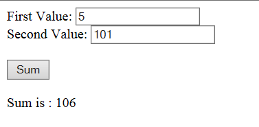

= AngularJS Tutorial – HelloWorld Example
Doc Writer <pavel.kiselev@gmail.com>
v1.0
:toc:

http://howtodoinjava.com/angularjs/angularjs-tutorial-helloworld-example/[original]

****
This https://angularjs.org/[AngularJS] *tutorial* covers following topics to give you better good understanding of AngularJS in detail.
****

== Why AngularJS?

When initially websites were built, they worked purely on complete request-response model. Flow was like – first a webpage was rendered in browser – then user does any interaction in webpage e.g. form submit or button click – a fresh request goes to server and then whole new page returned from server to render response in browser.

This model was in use until Microsoft introduced `XMLHttpRequest` which enabled the developers to make *asynchronous* calls to the server without actually having to refresh the page, and use the server response to partially refresh the page. This made for a much more coherent user experience because the user could perform a task that required a remote call and still interact with the application as the call was being made and processed.

At this time-period only, most JS frameworks came into picture such as jQuery, prototype etc. jQuery was most noticeable framework in that list – and it is probably still the best and most easy choice for UI development.

If you have worked on considerably big project which uses jQuery in UI components, then you can easily relate that over a period of time – code maintenance become sort of hell. After some time, you have 100+ JS files or even more in project – which all are referring to each other with no design enforcement. jQuery indeed is great framework to make coding easy, but it lacks any structural guidance that can help us when the code base grows. And so we end up with spaghetti code that is difficult to maintain and test.

This is where architectural patterns such as http://howtodoinjava.com/scripting/implement-mvc-and-pubsub-in-javascript/[Model View Controller (MVC)] and frameworks such as AngularJS come into the picture. Google’s AngularJS is an all-inclusive JavaScript model-view-controller (MVC) framework that makes it very easy to quickly build applications that run well on any desktop or mobile platform. AngularJS has complete support for unit testing to help reduce quality assurance (QA) time.

Models and views in AngularJS are much simpler than what you find in most JavaScript client-side frameworks. Controllers, often missing in other JavaScript client-side frameworks, are key functional components in AngularJS.

== Advantages of using AngularJS?

Let’s note down some other benefits which Angular offers over other frameworks –

- Angular modifies the page DOM directly instead of adding inner HTML code. It is faster.
- Angular builds the bindings based on the Angular-specific element attributes in the page. This helps in less writing, the code is cleaner, easier to understand and less error prone.
- Angular has some extended features such as dependency injection, routing, animations, view orchestration, and more. They helps in writing more robust and maintainable code, and encourages good design practices.
- AngularJS has complete support for unit testing.
- Pub-sub system in Angular supports context aware communication. `broadcast()` will send a message to all children controllers, while `emit()` will send a message to all ancestors.
- It is supported by Google and a great development community.

== Understanding AngularJS Components

As we already learned that AngularJS is structured framework based on an MVC, so we will require to write many components and utilities to make your application code structured and well maintained. Let’s learn these components in short. We will discuss then in detail in next tutorial(s).

=== Modules

A module is a collection of controllers, directives, filters, services, and other configuration information. The main player in all this is `angular.module()`, as it is the gateway into the Module API, the mechanism used to configure angular modules. It is used to register, create, and retrieve previously created AngularJS modules.

e.g. Add the following code to a new JavaScript file, which you can name `myAppModule.js`.

[source,javascript]
----
// Create a new module
var myAppModule = angular.module('myAppModule', []);
----

You just created a module. Easy, isn’t it?

Array parameter passed in `module()` can be used to pass a list of dependencies; that is, other modules that this module depends upon. We don’t have any dependencies, so we simply pass an empty array instead.

Now, you can use `myAppModule` variable to define module specific other components such as controllers or filters. e.g.

[source,javascript]
----
// configure the module with a controller
myAppModule.controller('MyFilterDemoCtrl', function ($scope) {
         // controller code would go here
      }
);
----

=== Scopes

In AngularJS, `$scope` is an object with the available properties and methods to be used. Note that scope is available for both the view and the controller.
When you make a controller in AngularJS, you pass the $scope object as argument.

[source,javascript]
----
var myAppModule = angular.module('MyFilterDemoCtrl', []);

myAppModule.controller('myController', function($scope) {
    $scope.firstName = "Lokesh";
});
----

When adding properties to the `$scope` in the controller, the view (HTML) gets access to these properties.

[source,html]
----

<h1>{{firstName}}</h1>

----

=== Directives

AngularJS directives are *extended HTML attributes* with the prefix `"ng-"`. There are some predefined directives such as `ng-app`, `ng-init` and `ng-controller`. Additionally, you can define your own directives as well.

For example, using `ng-init` directive, you can initialize application data to some default value.

[source,html]
----

<h1>{{firstName}}</h1>

----

=== Expressions

The scope variables used in view, are expressions in fact. These expressions are written inside double braces: `{{ expression }}`. You can write simple expressions as well as complex expressions such as `{{ firstName + " " + lastName }}` or `{{ "id = " + 0 }}`.

=== Controllers

In Angular, controllers augment the scope by setting up the initial state or values in the scope and by adding behavior to the scope. For example, you can add a function that sums values in a scope to provide a total such that if the model data behind the scope changes, the total value always changes.

You have to add controllers to HTML elements by using “ng-controller” and then implement them as JavaScript code in the background.

[source,html]
----

First Value: <input type="text" ng-model="firstValue"> 
Second Value: <input type="text" ng-model="secondValue"> 

 
Sum is = {{sum()}}

----

=== Data Binding or Model

This is the best feature of AngularJS. Data binding is the process of linking data from the model with what is displayed in a web page. AngularJS provides a very clean interface to link the model data to elements in a web page.

In AngularJS data binding is a two-way process: When data is changed on a web page, the model is updated, and when data is changed in the model, the web page is automatically updated. This way, the *model is always the only source for data represented to the user*, and the *view is just a projection of the model*.

The above example in “Controllers” section, is also an example of data binding. So when you change “First Value” or “Second Value” in text boxes, the sum field is automatically updated, without additional effort. It’s simply awesome.

=== Services

Services are the major workhorses in the AngularJS environment. Services are singleton objects that provide functionality for a web app. For example, a common task of web applications is to perform AJAX requests to a web server. AngularJS provides an HTTP service that houses all the functionality to access a web server.

The service functionality is completely independent of context or state, so it can be easily consumed from the components of an application. AngularJS provides a lot of built-in service components for basic uses, such as HTTP requests, logging, parsing, and animation. You can also create your own services and reuse them throughout your code.

For example, `$http` is a core service for reading data from web servers. We can use this service as below manner.

[source,javascript]
----
var app = angular.module('myApp', []);
app.controller('customersCtrl', function($scope, $http) {
    $http.get("some HTTP URL")
    .then(function(response) {
        //process the response here
    });
});
----

=== Compiler

AngularJS provides an HTML compiler that will discover directives in the AngularJS template and use the JavaScript directive code to build out extended HTML elements.

The AngularJS compiler is loaded into the browser when the AngularJS library is bootstrapped. When loaded, the compiler will search through the HTML DOM in the browser and link in any back-end JavaScript code to the HTML elements, and then the final application view will be rendered to the user.

== Building AngularJS HelloWorld application

So far we have understood some important concepts involved in AngularJS. Let’s use all this knowledge to build our first hello world application.

In this example, we will try to use all components without adding complexity so that it is easy to understand. Later if you want, you can try adding features and thus adding more complexity in this application.

This application displays two text boxes where you can input any number and click on sum button to add the values and update the message displayed beneath them. It looks like this image:

Let’s see the code of HTML view and angular controller JS file to understand how it works.

[source,html]
.helloWorld.html
----
<!doctype html>
<html ng-app="helloWorldApp">
<head>
    <title>Hello World - AngularJS</title>
</head>
<body>
    

        First Value: <input type="text" ng-model="first">  
        Second Value: <input type="text" ng-model="second">   
        <button ng-click='updateSum()'>Sum</button>   
        {{heading}}  {{total}}
    

    
    
</body>
</html>
----

[source,javascript]
.app.js
----
var firstApp = angular.module('helloWorldApp', []);
firstApp.controller('MyController', function($scope) {
    $scope.first = 5;
    $scope.second = 10;
    $scope.heading = 'Sum is : ';
    $scope.total = 15;
    $scope.updateSum = function() {
        $scope.total = parseInt($scope.first) + parseInt($scope.second);
    };
});
----

When you execute above code, you will see the output as attached image as a working application.

Happy Learning !!
