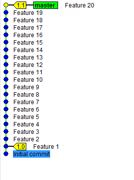
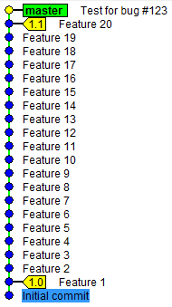
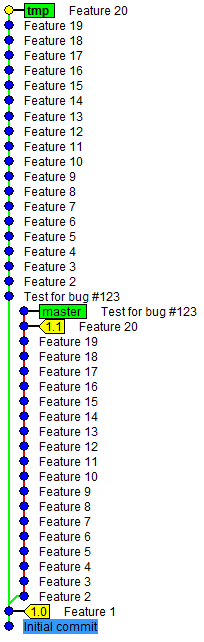

= Automated bug finding with git bisect and mvn test

Do you know the feeling when you discover a bug in a functionality that was working couple of weeks (or versions) ago? Too bad we didn’t have any automated tests and what used to be fine, now is broken. Let’s take this simple repository as an example:

== Write test first

We noticed that some particular functionality was OK in version 1.0 but is broken in 1.1. What is the first thing we do? Of course write a http://www.nurkiewicz.com/2009/12/adapter-pattern-revised.html[test case] to make sure this bug, once fixed, never comes back! Writing (failing) test for every bug you find has many advantages:

. It documents bugs and proves they were fixed
. Non-obvious workarounds and solutions will not be removed ("why was he checking for null here?! It’s impossible, let's simplify it") by accident
. You gradually improve overall code coverage, even in legacy codebase.

So you have a failing test case. But even with isolated test you can't reliably figure out what is wrong. If only we could find a commit that
broke that test - assuming commits are small and focused. But if we commit our test right now and check in one of the older versions to run it - it's not yet there. After all, test made its why to the codebase just now, if it was there from the first revision, we wouldn't have the
problem altogether:

== Interactive rebasing

Maybe instead of committing the test after version 1.1 (where we know it's broken) we should make a patch or stash this test? This way we could go through all revisions between 1.0 and 1.1, unstashing or applying patch with test and running it. Hope you agree this is far from perfect. The first trick is to use interactive rebase in order to shift commit with failing test case back in time. However we don't want to rebase master branch so we make a temporary copy and rebase it instead:

[source,text]
----
$ git checkout -b tmp
Switched to a new branch 'tmp'

$ git rebase -i 1.0 tmp
Successfully rebased and updated refs/heads/tmp.
----

Interactive rebase will ask us to rearrange commits before proceeding, just move commit with test case from last to first position:

[source,text]
----
pick 10dbcc9 Feature 2
pick f4cf58a Feature 3
pick 8287434 Feature 4
pick e79d56f Feature 5
pick 50614b6 Feature 6
pick 21ae08f Feature 7
pick 1e5b5a5 Feature 8
pick f703abf Feature 9
pick 686d7a9 Feature 10
pick b5b5cf1 Feature 11
pick 8e58593 Feature 12
pick 3ab419a Feature 13
pick 0e769a0 Feature 14
pick 8bfdbea Feature 15
pick 0a95b7f Feature 16
pick 4622cbc Feature 17
pick 757c4eb Feature 18
pick 3d94d7e Feature 19
pick da69f6a Feature 20
pick 733bd17 Test for bug #123
----

Now our repository should look somewhat like this:

== git bisect

Most importantly, our test case is now injected right after version 1.0 (known to be good). All we have to do is check in all revisions one after another and run this test. STOP! If you are smart (or lazy) you will start from commit right in the middle and if this one is broken you proceed with first half the same way - or take second half otherwise. It's sort of like binary search. However keeping track of which commit was last seen good and bad and also manually checking in revision in the middle is quite cumbersome. Luckily git can do this for us with `git bisect` command. In principal after starting bisecting we specify last known good and first known bad commit. Git will check in revision in between and ask us whether it's good or bad, continuing until we find exactly which commit broke code. In our case we simply run `mvn test` and proceed depending on its outcome:

[source,text]
----
$ git bisect start

$ git bisect good 1.0

$ git bisect bad tmp
Bisecting: 9 revisions left to test after this (roughly 3 steps)
[13ed8405beb387ec86874d951cf630de2c4fd927] Feature 10

$ mvn test -Dcom.nurkiewicz.BugTest
...
[INFO] BUILD SUCCESS

$ git bisect good
Bisecting: 4 revisions left to test after this (roughly 2 steps)
[b9e610428b61ba1436219edbaa1c5c435a1907ae] Feature 15

$ mvn test -Dcom.nurkiewicz.BugTest
...
[INFO] BUILD SUCCESS

$ git bisect good
Bisecting: 2 revisions left to test after this (roughly 1 step)
[e8a5ddd4dea219d826a15f7a085e412c29333b10] Feature 17

$ mvn test -Dcom.nurkiewicz.BugTest
...
[INFO] BUILD FAILURE

$ git bisect bad
Bisecting: 0 revisions left to test after this (roughly 0 steps)
[6d974faffa042781a098914a80d962953a492cb5] Feature 16

$ mvn test -Dcom.nurkiewicz.BugTest
...
[INFO] BUILD SUCCESS

$ git bisect good
e8a5ddd4dea219d826a15f7a085e412c29333b10 is the first bad commit
commit e8a5ddd4dea219d826a15f7a085e412c29333b10
Author: Tomasz Nurkiewicz
Date:   Wed Mar 19 19:43:40 2014 +0100

    Feature 17

:100644 100644 469c856b4ede8 90d6b2233832 M      SomeFile.java
----

See how we iteratively call `git good/bad` executing our test case in between? Also notice how quickly the number of commits to test shrinks. You might think this is neat and fast (logarithmic time!), but we can actually go much faster. git bisect has a hidden gem called run mode. Instead of relying on manual answer from the user after each iteration we can provide a script that tells whether given revision is good or bad. By convention if this script exits with code 0 it means success while any other exit code signals an error. Luckily mvn script follows this convention so we can simply execute `git bisect mvn test -Dcom.nurkiewicz.BugTest`, sit back and relax:

[source,text]
----
$ git bisect start

$ git bisect good 1.0

$ git bisect bad tmp
Bisecting: 9 revisions left to test after this (roughly 3 steps)
[13ed8405beb387ec86874d951cf630de2c4fd927] Feature 10

$ git bisect run mvn test -Dcom.nurkiewicz.BugTest
running mvn test -Dcom.nurkiewicz.BugTest
...
[INFO] BUILD SUCCESS
...
Bisecting: 4 revisions left to test after this (roughly 2 steps)
[b9e610428b61ba1436219edbaa1c5c435a1907ae] Feature 15
running mvn test -Dcom.nurkiewicz.BugTest
...
[INFO] BUILD SUCCESS
...
Bisecting: 2 revisions left to test after this (roughly 1 step)
[e8a5ddd4dea219d826a15f7a085e412c29333b10] Feature 17
running mvn test -Dcom.nurkiewicz.BugTest
...
[INFO] BUILD FAILURE
...
Bisecting: 0 revisions left to test after this (roughly 0 steps)
[6d974faffa042781a098914a80d962953a492cb5] Feature 16
running mvn test -Dcom.nurkiewicz.BugTest
...
[INFO] BUILD SUCCESS
...
e8a5ddd4dea219d826a15f7a085e412c29333b10 is the first bad commit
commit e8a5ddd4dea219d826a15f7a085e412c29333b10
Author: Tomasz Nurkiewicz
Date:   Wed Mar 19 19:43:40 2014 +0100

    Feature 17

:100644 100644 469c856b4ede8 90d6b2233832 M      SomeFile.java
bisect run success
----

Program above is non-interactive and fully automated. git, after few iterations, points precisely which commit was the first one to break the test. We can run all tests, but there is no point since we know only this one fails. Of course you can use any other command rather than mvn. You can even write some simple script in any JVM language of your choice (use `System.exit ()`). `git bisect`, combined with interactive rebasing, are wonderful tools to look for regressions and bugs. Also they promote automated testing and automation in general.
