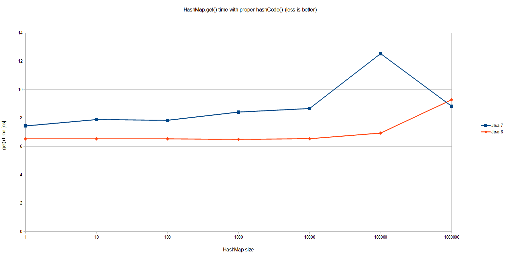
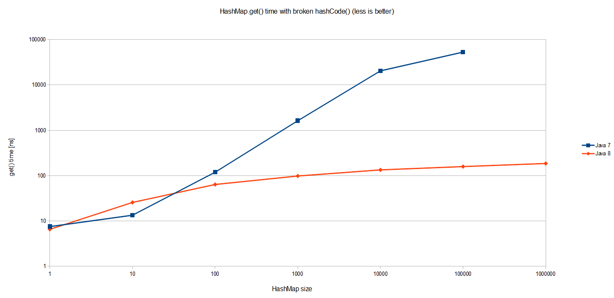
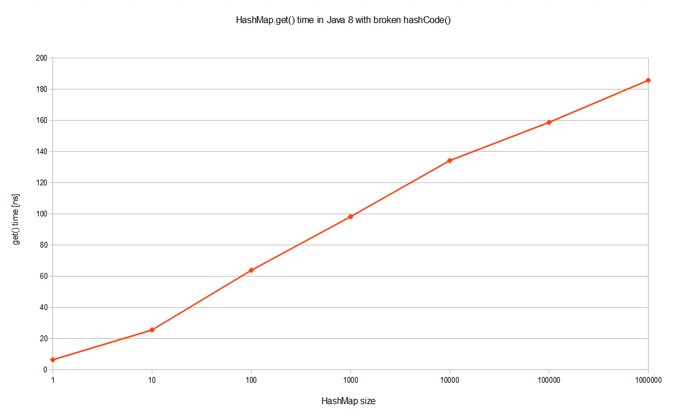

= HashMap performance improvements in Java 8

`HashMap<K, V>` is fast, versatile and ubiquitous data structure in every Java program. First some basics. As you probably know, it uses `hashCode()` and `equals()` method of keys to split values between buckets. The number of buckets (bins) should be slightly higher than the number of entries in a map, so that each bucket holds only few (preferably one) value. When looking up by key, we very quickly determine bucket (using `hashCode()` modulo number_of_buckets) and our item is available at constant time.

This should have already been known to you. You probably also know that hash collisions have disastrous impact on `HashMap` performance. When multiple `hashCode()` values end up in the same bucket, values are placed in an ad-hoc linked list. In worst case, when all keys are mapped to the same bucket, thus degenerating hash map to linked list - from O(1) to O(n) lookup time. Let's first benchmark how `HashMap` behaves under normal circumstances in Java 7 (1.7.0_40) and Java 8 (1.8.0-b132). To have full control over `hashCode()` behaviour we define our custom `Key` class:

[source,java]
----
class Key implements Comparable<Key> {

    private final int value;

    Key(int value) {
        this.value = value;
    }

    @Override
    public int compareTo(Key o) {
        return Integer.compare(this.value, o.value);
    }

    @Override
    public boolean equals(Object o) {
        if (this == o) return true;
        if (o == null || getClass() != o.getClass())
            return false;
        Key key = (Key) o;
        return value == key.value;
    }

    @Override
    public int hashCode() {
        return value;
    }
}
----

`Key` class is well-behaving: it overrides `equals()` and provides decent `hashCode()`. To avoid excessive GC I cache immutable `Key` instances rather than creating them from scratch over and over:

[source,java]
----
public class Keys {

    public static final int MAX_KEY = 10_000_000;
    private static final Key[] KEYS_CACHE = new Key[MAX_KEY];

    static {
        for (int i = 0; i < MAX_KEY; ++i) {
            KEYS_CACHE[i] = new Key(i);
        }
    }

    public static Key of(int value) {
        return KEYS_CACHE[value];
    }

}
----

Now we are ready to experiment a little bit. Our benchmark will simply create `HashMaps` of different sizes (powers of 10, from 1 to 1 million) using continuous key space. In the benchmark itself we will lookup values by key and measure how long it takes, depending on the `HashMap` size:

[source,java]
----
import com.google.caliper.Param;
import com.google.caliper.Runner;
import com.google.caliper.SimpleBenchmark;

public class MapBenchmark extends SimpleBenchmark {

    private HashMap<Key, Integer> map;

    @Param
    private int mapSize;

    @Override
    protected void setUp() throws Exception {
        map = new HashMap<>(mapSize);
        for (int i = 0; i < mapSize; ++i) {
            map.put(Keys.of(i), i);
        }
    }

    public void timeMapGet(int reps) {
        for (int i = 0; i < reps; i++) {
            map.get(Keys.of(i % mapSize));
        }
    }

}
----

The results confirm that `HashMap.get()` is indeed O(1):

Interestingly Java 8 is on average 20% faster than Java 7 in simple `HashMap.get()`. The overall performance is equally interesting: even with one million entries in a `HashMap` a single lookup taken less than 10 nanoseconds, which means around 20 CPU cycles on my machine*. Pretty impressive! But that's not what we were about to benchmark.

Suppose that we have a very poor map key that always returns the same value. This is the worst case scenario that defeats the purpose of using `HashMap` altogether:

[source,java]
----
class Key implements Comparable<Key> {

    //...

    @Override
    public int hashCode() {
        return 0;
    }
}
----

I used the exact same benchmark to see how it behaves for various map sizes (notice it's a log-log scale):

Results for Java 7 are to be expected. The cost of `HashMap.get()` grows proportionally to the size of the `HashMap` itself. Since all entries are in the same bucket in one huge linked list, looking up one requires traversing half of such list (of size n) on average. Thus O(n) complexity as visualized on the graph.

But Java 8 performs so much better! It's a log scale so we are actually talking about several orders of magnitude better. The same benchmark executed on JDK 8 yields O(logn) worst case performance in case of catastrophic hash collisions, as pictured better if JDK 8 is visualized alone on a log-linear scale:

What is the reason behind such a tremendous performance improvement, even in terms of big-O notation? Well, this optimization is described in http://openjdk.java.net/jeps/180[JEP-180]. Basically when a bucket becomes too big (currently: `TREEIFY_THRESHOLD = 8`), `HashMap` dynamically replaces it with an ad-hoc implementation of tree map. This way rather than having pessimistic O(n) we get much better O(logn). How does it work? Well, previously entries with conflicting keys were simply appended to linked list, which later had to be traversed. Now `HashMap` promotes list into binary tree, using hash code as a branching variable. If two hashes are different but ended up in the same bucket, one is considered bigger and goes to the right. If hashes are equal (as in our case), `HashMap` hopes that the keys are Comparable, so that it can establish some order. This is not a requirement of `HashMap` keys, but apparently a good practice. If keys are not comparable, don't expect any performance improvements in case of heavy hash collisions.

Why is all of this so important? Malicious software, aware of hashing algorithm we use, might craft couple of thousand requests that will result in massive hash collisions. Repeatedly accessing such keys will significantly impact server performance, effectively resulting in denial-of-service attack. In JDK 8 an amazing jump from O(n) to O(logn) will prevent such attack vector, also making performance a little bit more predictive. I hope this will finally convince your boss to upgrade.

----
Benchmarks executed on Intel Core i7-3635QM @ 2.4 GHz, 8 GiB of RAM and SSD drive, running on 64-bit Windows 8.1 and default JVM settings.
----
