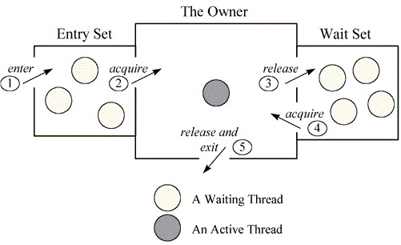

= Difference between lock and monitor – Java Concurrency
Doc Writer <pavel.kiselev@gmail.com>
v1.0
:toc:

http://howtodoinjava.com/core-java/multi-threading/multithreading-difference-between-lock-and-monitor/[original]

****
You may have faced this question in your interview that what is the *difference between lock and a monitor*? Well, to answer this question you must have good amount of understanding of how java multi-threading works under the hood.

Short answer, locks provide necessary support for implementing monitors. Long answer read below.
****

== Locks

*A lock is kind of data which is logically part of an object’s header on the heap memory*. Each object in a JVM has this lock (or mutex) that any program can use to coordinate multi-threaded access to the object. If any thread want to access instance variables of that object; then thread must “own” the object’s lock (set some flag in lock memory area). All other threads that attempt to access the object’s variables have to wait until the owning thread releases the object’s lock (unset the flag).

Once a thread owns a lock, it can request the same lock again multiple times, but then has to release the lock the same number of times before it is made available to other threads. If a thread requests a lock three times, for example, that thread will continue to own the lock until it has “released” it three times.

Please note that lock is acquired by a thread, when it explicitly ask for it. In Java, this is done with the synchronized keyword, or with `wait` and `notify`.

== Monitors

*Monitor is a synchronization construct that allows threads to have both mutual exclusion (using locks) and cooperation* i.e. the ability to make threads wait for certain condition to be true (using *wait-set*).

In other words, along with data that implements a lock, every Java object is logically associated with data that implements a `wait-set`. Whereas locks help threads to work independently on shared data without interfering with one another, wait-sets help threads to cooperate with one another to work together towards a common goal e.g. all waiting threads will be moved to this wait-set and all will be notified once lock is released. *This wait-set helps in building monitors with additional help of lock (mutex)*.

=== Mutual exclusion

Putting in very simple words, a monitor is like a building that contains one special room (object instance) that can be occupied by only one thread at a time. The room usually contains some data which needs to be protected from concurrent access. From the time a thread enters this room to the time it leaves, it has exclusive access to any data in the room. Entering the monitor building is called “entering the monitor.” Entering the special room inside the building is called “acquiring the monitor.” Occupying the room is called “owning the monitor,” and leaving the room is called “releasing the monitor.” Leaving the entire building is called “exiting the monitor.”

When a thread arrives to access protected data (enter the special room), it is first put in queue in building reception (entry-set). If no other thread is waiting (own the monitor), the thread acquires the lock and continues executing the protected code. When the thread finishes execution, it release the lock and exits the building (exiting the monitor).

If when a thread arrives and another thread is already owning the monitor, it must wait in reception queue (entry-set). When the current owner exits the monitor, the newly arrived thread must compete with any other threads also waiting in the entry-set. Only one thread will win the competition and own the lock.

*There is no role of wait-set feature.*

=== Cooperation

In general, mutual exclusion is important only when multiple threads are sharing data or some other resource. If two threads are not working with any common data or resource, they usually can’t interfere with each other and needn’t execute in a mutually exclusive way. Whereas mutual exclusion helps keep threads from interfering with one another while sharing data, cooperation helps threads to work together towards some common goal.

*Cooperation is important when one thread needs some data to be in a particular state and another thread is responsible for getting the data into that state e.g. producer/consumer problem* where read thread needs the buffer to be in a “not empty” state before it can read any data out of the buffer. If the read thread discovers that the buffer is empty, it must wait. The write thread is responsible for filling the buffer with data. Once the write thread has done some more writing, the read thread can do some more reading. It is also sometimes called a *“Wait and Notify”* OR *“Signal and Continue”* monitor because it retains ownership of the monitor and continues executing the monitor region (the continue) if needed. At some later time, the notifying thread releases the monitor and a waiting thread is resurrected to own the lock.

*This cooperation requires both i.e. entry-set and wait-set.* Below given diagram will help you in understand this cooperation.

Above figure shows the monitor as three rectangles. In the center, a large rectangle contains a single thread, the monitor’s owner. On the left, a small rectangle contains the entry set. On the right, another small rectangle contains the wait set.

I hope that above discussion will help you in getting more insight. Free free to ask any question.

Happy Learning !!
