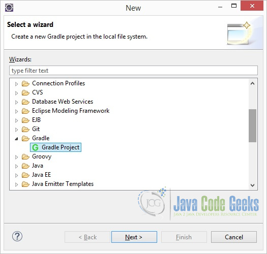
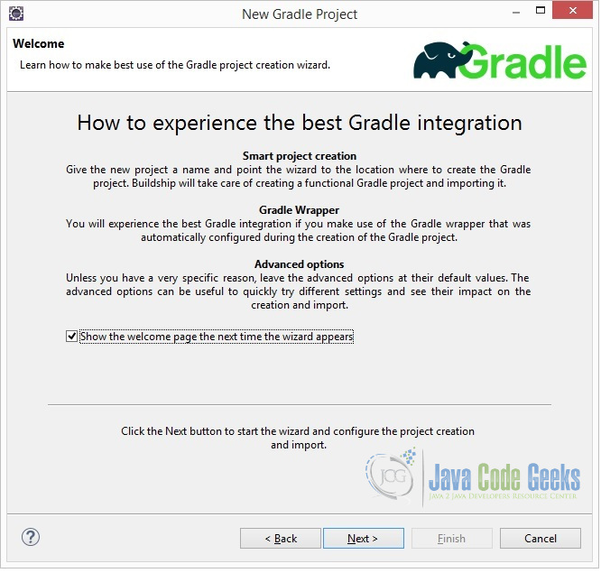

= Spring Boot Tutorial for beginners

Posted by: Srujana Cherukuri  in Boot February 29th, 2016

== 1. Introduction

When I just heard about Spring Boot there were many questions to pop out of my head “What is it? Why do I need it? How different is it to the other features under the same Spring umbrella?” etc. I am sure you would have had similar inquisitions too.

In short, Spring Boot takes care of application infrastructure while you can focus on coding the actual business flesh. Surely fast tracks building of applications. It makes reasonable assumptions of the dependencies and adds them accordingly. It also lets you customize the dependencies according to your requirement.

In the following sections, I am going to site a sample application example using Spring Boot.

== 2. Environment

This tutorial assumes that you have basic understanding of Gradle build framework and also that your Eclipse IDE (Luna) environment is fully setup and configured with:

- Java 1.8
- Gradle 2.9
- Groovy Eclipse Plugin
- Eclipse Buildship Plugin for Eclipse Gradle integration

In addition to the above you need the following to work on this sample application.

- Spring Boot 1.3.2
- Spring Boot Gradle plugin

This tutorial assumes that you have basic understanding of Spring framework.

== 3. Sample Application using Spring Boot

=== 3.1. Create and configure a Gradle project in Eclipse IDE

In the Eclipse IDE, click File -> New -> Other:

Select “Gradle Project”:

Take a moment to read the suggestions in the following screen. Press next.

Enter the name of your project.

Keep the default and recommended Gradle Wrapper option selected and press next.

Press finish on the preview screen.

You have successfully created the Gradle project. The following is the project structure of your Gradle project.

=== 3.2. build.gradle

==== 3.2.1 Modify build.gradle

In the Eclipse IDE, open the `build.gradle` file that is in the project root directory. Modify the file as shown below.

_build.gradle_

[source,java]
----
buildscript {
    repositories {
        mavenCentral()
    }
    dependencies {
        classpath("org.springframework.boot:spring-boot-gradle-plugin:1.3.2.RELEASE")
    }
}

apply plugin: 'java'
apply plugin: 'eclipse'
apply plugin: 'spring-boot'

jar {
    baseName = 'sample'
    version =  '0.1.0'
}

repositories {
    mavenCentral()
}

sourceCompatibility = 1.8
targetCompatibility = 1.8

dependencies {
    compile("org.springframework.boot:spring-boot-starter-web")

}
----

==== 3.2.2 Walk through build.gradle

[source,java]
----
buildscript {
    repositories {
        mavenCentral()
    }
    dependencies {
        classpath("org.springframework.boot:spring-boot-gradle-plugin:1.3.2.RELEASE")
    }
}

apply plugin:"spring-boot"
----

The `buildscript()` method is used to add any external libraries to script’s classpath, by passing in a closure that declares the build script classpath using `classpath` configuration.

Any binary plugins that have been published as external jars can be added to the project by adding them to the `classpath` configuration and then applying the plugin.

In our example, `spring-boot-gradle-plugin` is the binary plugin that needs to be added to our project. And `apply plugin:"spring-boot"` is used to apply the plugin.

Spring Boot Gradle plugin is added to project to provide Spring Boot support in Gradle.

Follow the link Spring Boot Gradle plugin to dig further about this plugin.

[source,java]
----
apply plugin: 'java'
apply plugin: 'eclipse'
----

The `java` plugin adds compilation, testing and bundling capabilities to the project. When build using the tasks from the eclipse plugin, certain files are added to project to enable it to get imported into Eclipse IDE.

[source,java]
----
jar {
    baseName = 'sample'
    version =  '0.1.0'
}
----

When the project is built with `gradle clean build`, the jar file with name sample-0.1.0.jar is created in the `$PROJECT_ROOT/build/lib` folder of the project.

[source,java]
----
repositories {
    mavenCentral()
}
----

This is to specify the repository where the dependencies will be downloaded from.

[source,java]
----
sourceCompatibility = 1.8
targetCompatibility = 1.8
----

The `sourceCompatibility` is Java version compatibility to use when compiling Java source. Default value is version of the current JVM in use. The `targetCompatibility` is Java version to generate classes for. The default value is sourceCompatibility.

[source,java]
----
dependencies {
    compile("org.springframework.boot:spring-boot-starter-web")
}
----

To specify the required dependency for Spring Boot.

==== 3.2.3 Run initial build

At the command prompt run:

[source,java]
----
gradle clean build
----

During build process, Spring Boot Gradle plugin looks for class with `public static void main()` to flag it as runnable class. As we haven’t created a class with `public static void main()` yet, the build fails as shown below.

=== 3.3. Create SampleApplication.java

Let’s create a simple runnable class with `public static void main()`. In Eclipse IDE, right click on source folder `src/main/java` and select New -> Other.

Select “Class” in the resultant window. Click on “Next”:

Specify the package name “sample”, class name “SampleApplication” and select to create `public static void main(String[] args)` method, as shown in the below picture. Click on “Finish”.

After creating `SampleApplication.java`, the project structure looks as below.

At the command prompt run:

[source,java]
----
gradle clean build
----

As shown below the build is now successful.

As shown below Spring Boot makes reasonable assumptions of the dependencies and adds them automatically.

=== 3.4. Create SampleController.java

Lets us now create a simple controller `SampleController.java`

In Eclipse IDE, right click on source folder `src/main/java` and select New -> Other.

Select “Class” in the resultant window. Click on “Next”:

Specify the package name “sample”, class name “SampleController”. Click on “Finish”.

Following is the current snapshot of the project structure.

Modify `SampleController.java` as shown below.

_SampleController.java_

[source,java]
----
package sample;

import org.springframework.web.bind.annotation.RequestMapping;
import org.springframework.web.bind.annotation.RestController;

@RestController
public class SampleController {

    @RequestMapping("/sample")
    public String sampleIt(){
        return "Hello! Welcome to Spring Boot Sample. ";
    }
}
----

[source,java]
----
@RestController
----

The `@RestController` annotation marks the class as controller and adds `@Controller` and `@ResponseBody` annotations.

[source,java]
----
@RequestMapping
----

The `@RequestMapping` annotation ensures that HTTP requests to `/sample` is mapped to the `sampleIt()` method. As you would have already noticed, we didn’t have to create any web.xml for the mapping.

=== 3.5. SampleApplication.java

==== 3.5.1 Modify SampleApplication.java

_SampleApplication.java_

[source,java]
----
package sample;

import org.springframework.boot.SpringApplication;
import org.springframework.boot.autoconfigure.SpringBootApplication;
import org.springframework.context.ApplicationContext;

@SpringBootApplication
public class SampleApplication {

    public static void main(String[] args) {
        ApplicationContext ctx = SpringApplication.run(SampleApplication.class, args);
        System.out.println(ctx.getDisplayName());

        System.out.println("This is my first Spring Boot Example");

    }

}
----

Let’s explore through the `SampleApplication.java`:

[source,java]
----
@SpringBootApplication
----

If you are familiar with Spring framework, many-a-times you would have annotated your main class with `@Configuration`, `@ComponentScan` and `@EnableAutoConfiguration`. `@SpringBootApplication` is equivalent to using these three annotations `@Configuration`, `@ComponentScan` and `@EnableAutoConfiguration` with their default attributes.

To read further about these annotations, visit the links:

- http://docs.spring.io/autorepo/docs/spring/4.1.1.RELEASE/javadoc-api/org/springframework/context/annotation/Configuration.html[@Configuration]
- http://docs.spring.io/spring-boot/docs/current/api/org/springframework/boot/autoconfigure/EnableAutoConfiguration.html[@EnableAutoConfiguration]
- http://docs.spring.io/spring/docs/current/javadoc-api/org/springframework/context/annotation/ComponentScan.html[@ComponentScan]

[source,java]
----
ApplicationContext ctx = SpringApplication.run(SampleApplication.class, args);
----

`SpringApplication` is used to bootstrap and launch a Spring application from the main method.

=== 3.6 Run SampleApplication

At the command prompt:

[source,java]
----
gradle clean build bootRun
----

The output is as follows.

When invoked from browser the output is displayed as below.

== 4. References

http://projects.spring.io/spring-framework/[Spring Framework]
http://spring.io/docs[Spring Docs]
http://projects.spring.io/spring-boot/[Spring Boot]
https://docs.gradle.org/current/userguide/userguide.html[Gradle Documentation]
https://docs.gradle.org/current/userguide/dependency_management.html[Gradle dependency management]

== 5. Conclusion

That’s all Folks!! Make sure you make yourself a cuppa before jumping into additional reading through the links provided in “References” section.

== 6. Download the Eclipse project

You can download the full source code of this example here: http://examples.javacodegeeks.com/wp-content/uploads/2016/02/SpringBootExample.zip[Spring Boot Tutorial for Beginners]
